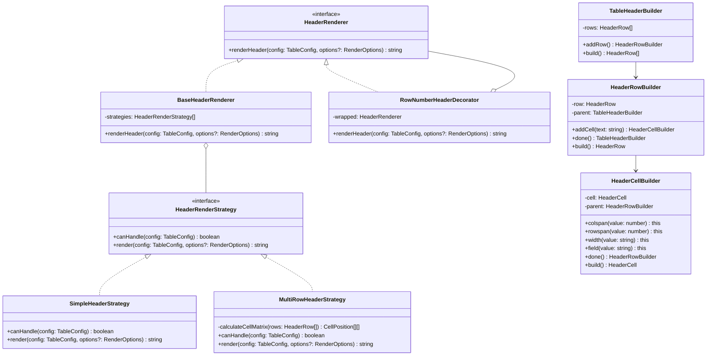

# Design Document: Table Header Merge

## Overview

本设计为表格组件添加复杂表头支持，允许表头单元格进行行合并（rowspan）和列合并（colspan）。设计采用 GoF 设计模式，实现高度可扩展和可维护的架构。

## Architecture

### 设计原则

1. **向后兼容**: 现有的 `TableConfig.columns` 配置继续工作
2. **渐进增强**: 新增 `headerRows` 配置用于复杂表头
3. **类型安全**: 完整的 TypeScript 类型定义
4. **GoF 设计模式**: 采用策略模式、建造者模式和组合模式

### 设计模式应用

#### 1. 策略模式 (Strategy Pattern)

用于表头渲染策略的选择，根据配置类型选择不同的渲染策略：

```
┌─────────────────────────────────────────────────────────┐
│                  HeaderRenderStrategy                    │
│                     <<interface>>                        │
├─────────────────────────────────────────────────────────┤
│ + render(config: TableConfig, options?: RenderOptions)  │
│ + canHandle(config: TableConfig): boolean               │
└─────────────────────────────────────────────────────────┘
                           ▲
                           │
          ┌────────────────┼────────────────┐
          │                │                │
┌─────────┴─────────┐ ┌────┴────────┐ ┌─────┴──────────┐
│ SimpleHeaderStrategy│ │MultiRowStrategy│ │RowNumberStrategy│
│ (单行表头)          │ │(多行表头)      │ │(行号列装饰器)   │
└───────────────────┘ └──────────────┘ └────────────────┘
```

#### 2. 建造者模式 (Builder Pattern)

用于构建复杂的表头配置，提供流畅的 API：

```typescript
const header = new TableHeaderBuilder()
  .addRow()
    .addCell('日期').rowspan(2).done()
    .addCell('血压').colspan(2).done()
    .addCell('体温').rowspan(2).done()
  .addRow()
    .addCell('收缩压').field('systolic').done()
    .addCell('舒张压').field('diastolic').done()
  .build()
```

#### 3. 组合模式 (Composite Pattern)

表头结构本身是一个组合模式的应用：

```
┌─────────────────┐
│  HeaderComponent │ <<abstract>>
├─────────────────┤
│ + render(): string │
└─────────────────┘
         ▲
         │
    ┌────┴────┐
    │         │
┌───┴───┐ ┌───┴───┐
│HeaderRow│ │HeaderCell│
│(组合)   │ │(叶子)    │
└────────┘ └─────────┘
```

#### 4. 装饰器模式 (Decorator Pattern)

用于添加行号列等可选功能：

```
┌─────────────────────────────────────────────────────────┐
│                  HeaderRenderer                          │
│                    <<interface>>                         │
├─────────────────────────────────────────────────────────┤
│ + renderHeader(config: TableConfig): string             │
└─────────────────────────────────────────────────────────┘
                           ▲
                           │
          ┌────────────────┴────────────────┐
          │                                 │
┌─────────┴─────────┐           ┌──────────┴──────────┐
│ BaseHeaderRenderer │           │RowNumberDecorator   │
│ (基础渲染器)        │           │(行号装饰器)          │
└───────────────────┘           └─────────────────────┘
```

### 配置优先级

```
headerRows 存在 → 使用 MultiRowHeaderStrategy
headerRows 不存在 → 使用 SimpleHeaderStrategy (从 columns 生成)
showRowNumber = true → 使用 RowNumberDecorator 包装
```

## Components and Interfaces

### 核心类型定义

```typescript
/** 表头单元格配置 */
export interface HeaderCell {
  /** 表头文本 */
  text: string
  /** 列合并数量 (默认: 1) */
  colspan?: number
  /** 行合并数量 (默认: 1) */
  rowspan?: number
  /** 单元格宽度 */
  width?: string
  /** 关联的数据列字段名 (用于最底层表头) */
  field?: string
}

/** 表头行配置 */
export interface HeaderRow {
  /** 该行的单元格列表 */
  cells: HeaderCell[]
}
```

### 扩展 TableConfig

```typescript
export interface TableConfig {
  /** 列配置 (用于数据渲染和简单表头) */
  columns: TableColumn[]
  /** 数据字段名 */
  dataField: string
  /** 是否显示行号 */
  showRowNumber?: boolean
  /** 多行表头配置 (可选，优先于 columns 生成的表头) */
  headerRows?: HeaderRow[]
}
```

### 策略模式接口

```typescript
/** 表头渲染策略接口 */
export interface HeaderRenderStrategy {
  /** 判断是否可以处理该配置 */
  canHandle(config: TableConfig): boolean
  /** 渲染表头 HTML */
  render(config: TableConfig, options?: RenderOptions): string
}

/** 简单表头策略 - 从 columns 生成单行表头 */
export class SimpleHeaderStrategy implements HeaderRenderStrategy {
  canHandle(config: TableConfig): boolean {
    return !config.headerRows || config.headerRows.length === 0
  }
  render(config: TableConfig, options?: RenderOptions): string
}

/** 多行表头策略 - 使用 headerRows 配置 */
export class MultiRowHeaderStrategy implements HeaderRenderStrategy {
  canHandle(config: TableConfig): boolean {
    return !!config.headerRows && config.headerRows.length > 0
  }
  render(config: TableConfig, options?: RenderOptions): string
}
```

### 建造者模式接口

```typescript
/** 表头单元格建造者 */
export class HeaderCellBuilder {
  private cell: HeaderCell
  
  constructor(text: string)
  colspan(value: number): this
  rowspan(value: number): this
  width(value: string): this
  field(value: string): this
  done(): HeaderRowBuilder  // 返回父建造者
  build(): HeaderCell
}

/** 表头行建造者 */
export class HeaderRowBuilder {
  private row: HeaderRow
  private parent: TableHeaderBuilder
  
  addCell(text: string): HeaderCellBuilder
  done(): TableHeaderBuilder  // 返回父建造者
  build(): HeaderRow
}

/** 表头建造者 */
export class TableHeaderBuilder {
  private rows: HeaderRow[]
  
  addRow(): HeaderRowBuilder
  build(): HeaderRow[]
}
```

### 装饰器模式接口

```typescript
/** 表头渲染器接口 */
export interface HeaderRenderer {
  renderHeader(config: TableConfig, options?: RenderOptions): string
}

/** 基础表头渲染器 */
export class BaseHeaderRenderer implements HeaderRenderer {
  private strategies: HeaderRenderStrategy[]
  
  constructor(strategies?: HeaderRenderStrategy[])
  renderHeader(config: TableConfig, options?: RenderOptions): string
}

/** 行号装饰器 - 为表头添加行号列 */
export class RowNumberHeaderDecorator implements HeaderRenderer {
  private wrapped: HeaderRenderer
  
  constructor(renderer: HeaderRenderer)
  renderHeader(config: TableConfig, options?: RenderOptions): string
}
```

### 单元格位置计算

```typescript
/** 单元格位置信息 */
interface CellPosition {
  row: number
  col: number
  cell: HeaderCell
  isOccupied: boolean  // 被上方 rowspan 占用
}

/** 计算单元格位置矩阵 */
function calculateCellMatrix(headerRows: HeaderRow[]): CellPosition[][]

/** 验证表头结构有效性 */
function validateHeaderStructure(headerRows: HeaderRow[], columnCount: number): ValidationResult
```

## Data Models

### 配置示例

#### 使用建造者模式创建复杂表头

```typescript
// 流畅的 API 创建血压分收缩压/舒张压的表头
const headerRows = new TableHeaderBuilder()
  .addRow()
    .addCell('日期').rowspan(2).done()
    .addCell('血压 (mmHg)').colspan(2).done()
    .addCell('体温 (℃)').rowspan(2).done()
  .addRow()
    .addCell('收缩压').field('systolic').done()
    .addCell('舒张压').field('diastolic').done()
  .build()

const config: TableConfig = {
  dataField: 'vitalSigns',
  columns: [
    { header: '日期', field: 'date', type: 'date' },
    { header: '收缩压', field: 'systolic', type: 'number' },
    { header: '舒张压', field: 'diastolic', type: 'number' },
    { header: '体温', field: 'temperature', type: 'number' },
  ],
  headerRows
}
```

#### 直接使用 JSON 配置

```typescript
const config: TableConfig = {
  dataField: 'vitalSigns',
  columns: [
    { header: '日期', field: 'date', type: 'date' },
    { header: '收缩压', field: 'systolic', type: 'number' },
    { header: '舒张压', field: 'diastolic', type: 'number' },
    { header: '体温', field: 'temperature', type: 'number' },
  ],
  headerRows: [
    {
      cells: [
        { text: '日期', rowspan: 2 },
        { text: '血压 (mmHg)', colspan: 2 },
        { text: '体温 (℃)', rowspan: 2 },
      ]
    },
    {
      cells: [
        { text: '收缩压', field: 'systolic' },
        { text: '舒张压', field: 'diastolic' },
      ]
    }
  ]
}
```

#### 生成的 HTML 结构

```html
<thead>
  <tr>
    <th rowspan="2">日期</th>
    <th colspan="2">血压 (mmHg)</th>
    <th rowspan="2">体温 (℃)</th>
  </tr>
  <tr>
    <th>收缩压</th>
    <th>舒张压</th>
  </tr>
</thead>
```

### 单元格位置矩阵计算

为了正确处理 rowspan，需要构建位置矩阵：

```typescript
// 输入配置
headerRows: [
  { cells: [{ text: 'A', rowspan: 2 }, { text: 'B', colspan: 2 }] },
  { cells: [{ text: 'C' }, { text: 'D' }] }
]

// 计算后的位置矩阵 (3列 x 2行)
[
  [{ cell: A, occupied: false }, { cell: B, occupied: false }, { cell: B, occupied: false }],
  [{ cell: A, occupied: true },  { cell: C, occupied: false }, { cell: D, occupied: false }]
]
```

### 类图



## Correctness Properties

*A property is a characteristic or behavior that should hold true across all valid executions of a system-essentially, a formal statement about what the system should do. Properties serve as the bridge between human-readable specifications and machine-verifiable correctness guarantees.*

### Property 1: Colspan/Rowspan 属性正确渲染

*For any* header cell configuration with colspan or rowspan values, the rendered HTML `<th>` element SHALL contain the correct `colspan` and `rowspan` attributes matching the configuration. When these values are not specified, they SHALL default to 1 (no attribute rendered).

**Validates: Requirements 1.1, 1.2, 2.1, 2.2**

### Property 2: 单元格位置正确性

*For any* multi-row header configuration, the total effective column count (accounting for colspan) in each row SHALL equal the total number of data columns. Cells with rowspan > 1 SHALL cause subsequent rows to have fewer explicit cells, and no cells SHALL overlap.

**Validates: Requirements 2.3, 3.3, 5.2**

### Property 3: 多行表头渲染

*For any* table configuration, if `headerRows` is provided, the renderer SHALL produce exactly that many `<tr>` elements in `<thead>`. If `headerRows` is not provided but `columns` is, the renderer SHALL produce a single-row header from the columns configuration.

**Validates: Requirements 3.1, 3.2**

### Property 4: 配置序列化往返

*For any* valid HeaderRow configuration, serializing to JSON and parsing back SHALL produce an equivalent configuration object.

**Validates: Requirements 4.1, 4.2, 4.3**

### Property 5: 有效 HTML 输出

*For any* header configuration (including those with showRowNumber), the rendered output SHALL be valid HTML table structure with consistent CSS classes applied to all header cells.

**Validates: Requirements 5.1, 5.3, 5.4**

## Error Handling

### 边界情况处理

1. **colspan 超出剩余列数**: 自动裁剪到可用列数
2. **rowspan 超出剩余行数**: 自动裁剪到可用行数
3. **空 headerRows**: 回退到 columns 生成表头
4. **headerRows 与 columns 列数不匹配**: 以 headerRows 定义为准，数据列按 columns 渲染

### 错误消息

```typescript
// 开发模式下的警告
console.warn('Table header colspan exceeds available columns, clamping to available space')
```

## Code Documentation Standards

### 废弃代码注释规范

对于被新设计替代但保留向后兼容的代码，使用 `@deprecated` JSDoc 标签：

```typescript
/**
 * 渲染简单表头（从 columns 配置生成）
 * 
 * @deprecated 自 v2.0.0 起，推荐使用 headerRows 配置和 HeaderRenderStrategy
 * 此方法保留用于向后兼容，将在 v3.0.0 中移除
 * 
 * @see MultiRowHeaderStrategy 新的多行表头渲染策略
 * @see TableHeaderBuilder 推荐的表头配置构建方式
 */
function renderSimpleHeader(columns: TableColumn[]): string
```

### 升级代码注释规范

对于新增的设计模式实现，使用详细的 JSDoc 文档：

```typescript
/**
 * 表头渲染策略接口
 * 
 * @since v2.0.0
 * @description
 * 实现策略模式，支持不同类型的表头渲染。
 * 
 * 设计模式: Strategy Pattern (GoF)
 * - 定义算法族，分别封装，使它们可以互相替换
 * - 让算法的变化独立于使用算法的客户
 * 
 * @example
 * ```typescript
 * // 使用策略
 * const strategy = config.headerRows 
 *   ? new MultiRowHeaderStrategy()
 *   : new SimpleHeaderStrategy()
 * const html = strategy.render(config, options)
 * ```
 */
export interface HeaderRenderStrategy {
  // ...
}

/**
 * 表头建造者
 * 
 * @since v2.0.0
 * @description
 * 实现建造者模式，提供流畅的 API 构建复杂表头配置。
 * 
 * 设计模式: Builder Pattern (GoF)
 * - 将复杂对象的构建与表示分离
 * - 同样的构建过程可以创建不同的表示
 * 
 * @example
 * ```typescript
 * const headerRows = new TableHeaderBuilder()
 *   .addRow()
 *     .addCell('日期').rowspan(2).done()
 *     .addCell('血压').colspan(2).done()
 *   .addRow()
 *     .addCell('收缩压').done()
 *     .addCell('舒张压').done()
 *   .build()
 * ```
 */
export class TableHeaderBuilder {
  // ...
}

/**
 * 行号表头装饰器
 * 
 * @since v2.0.0
 * @description
 * 实现装饰器模式，为表头添加行号列功能。
 * 
 * 设计模式: Decorator Pattern (GoF)
 * - 动态地给对象添加额外的职责
 * - 比继承更灵活的扩展功能方式
 * 
 * @example
 * ```typescript
 * const baseRenderer = new BaseHeaderRenderer()
 * const renderer = new RowNumberHeaderDecorator(baseRenderer)
 * const html = renderer.renderHeader(config, options)
 * ```
 */
export class RowNumberHeaderDecorator implements HeaderRenderer {
  // ...
}
```

### 版本迁移指南注释

在主要入口文件添加迁移指南：

```typescript
/**
 * @fileoverview 表格渲染器
 * @module renderer/section-renderers/table
 * @version 2.0.0
 * 
 * @migration v1.x → v2.0
 * 
 * ## 新增功能
 * - 多行表头支持 (headerRows 配置)
 * - 单元格合并 (colspan/rowspan)
 * - 建造者模式 API (TableHeaderBuilder)
 * 
 * ## 向后兼容
 * - 现有 columns 配置继续工作
 * - 不使用 headerRows 时行为不变
 * 
 * ## 推荐升级
 * ```typescript
 * // 旧方式 (仍然支持)
 * const config = {
 *   columns: [{ header: '日期', field: 'date' }]
 * }
 * 
 * // 新方式 (推荐用于复杂表头)
 * const config = {
 *   columns: [{ header: '日期', field: 'date' }],
 *   headerRows: new TableHeaderBuilder()
 *     .addRow().addCell('日期').done()
 *     .build()
 * }
 * ```
 */
```

## Testing Strategy

### 单元测试

1. 测试 colspan 属性渲染
2. 测试 rowspan 属性渲染
3. 测试默认值处理
4. 测试向后兼容性
5. 测试 showRowNumber 与多行表头的组合

### 属性测试

使用 fast-check 进行属性测试：

1. **Property 1**: 生成随机 HeaderCell 配置，验证渲染的 HTML 包含正确的属性
2. **Property 2**: 生成随机多行表头，验证列数一致性
3. **Property 3**: 生成有/无 headerRows 的配置，验证渲染行为
4. **Property 4**: 生成随机配置，验证 JSON 序列化往返
5. **Property 5**: 生成随机配置，验证 HTML 有效性

### 测试配置

- 每个属性测试运行至少 100 次迭代
- 使用 fast-check 的 `fc.record` 和 `fc.array` 生成器
- 标注格式: `**Feature: table-header-merge, Property N: [property_text]**`

